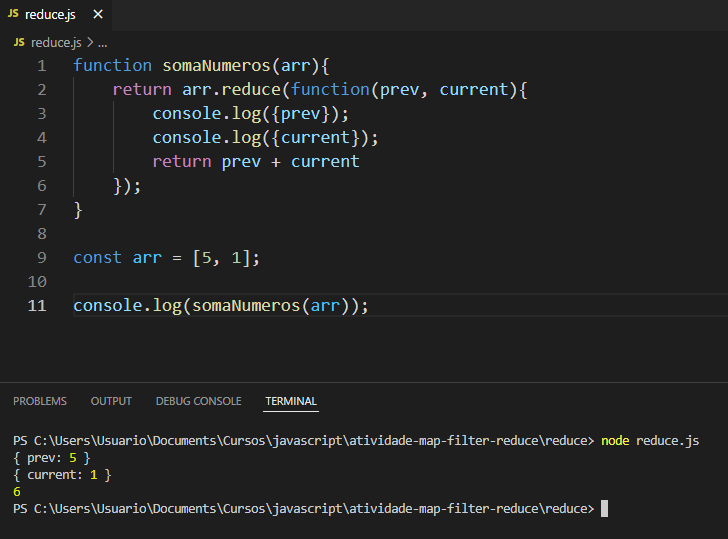
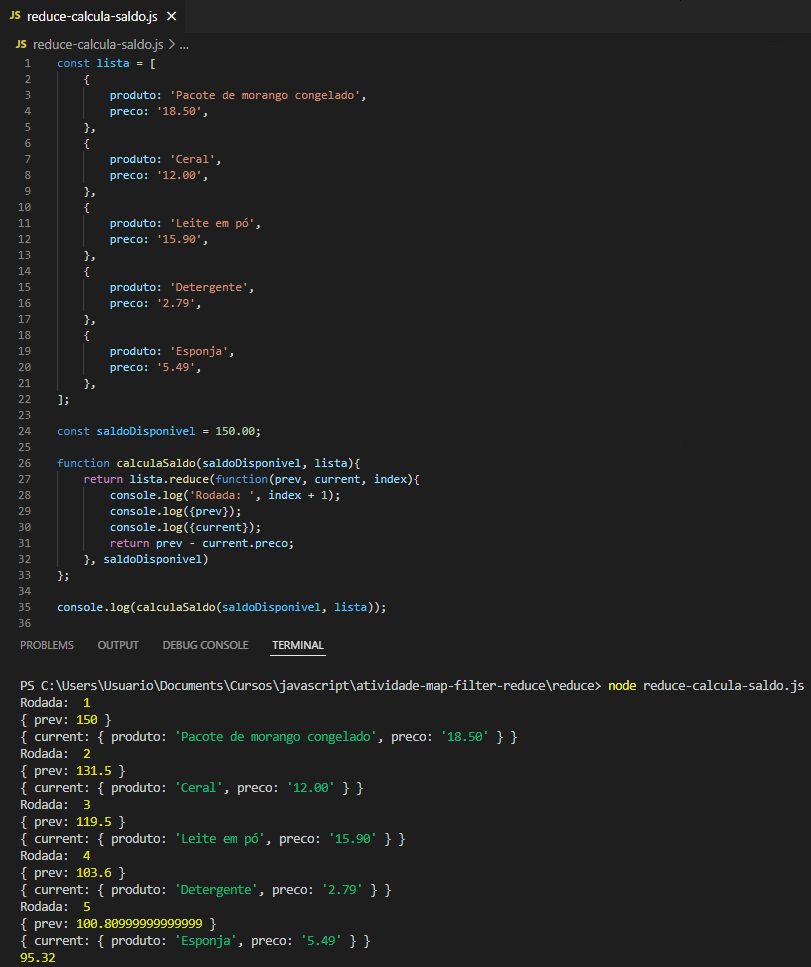

# Reduce

## Atividades:
1. Some todos os números de um array.
2. Crie uma função que recebe uma lista de preços e um número representando o saldo disponível. Calcule qual será o saldo final após subtrair todos os preços da lista enviada.

### Atividade 1:

### Atividade 2:

